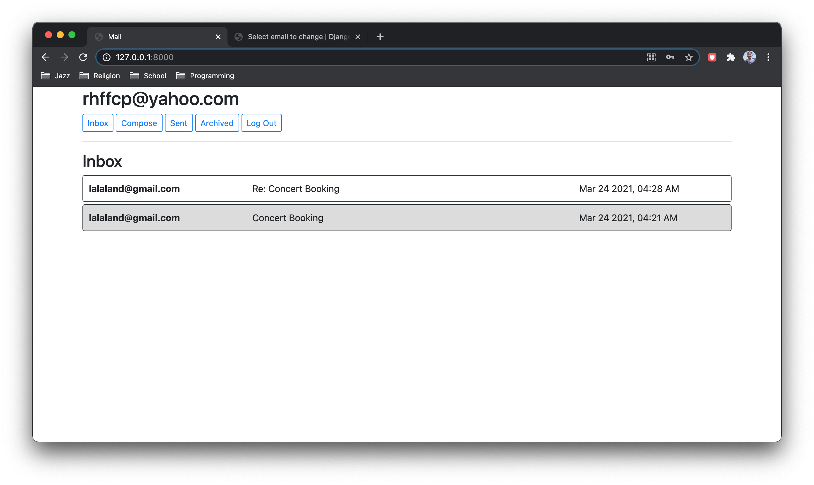
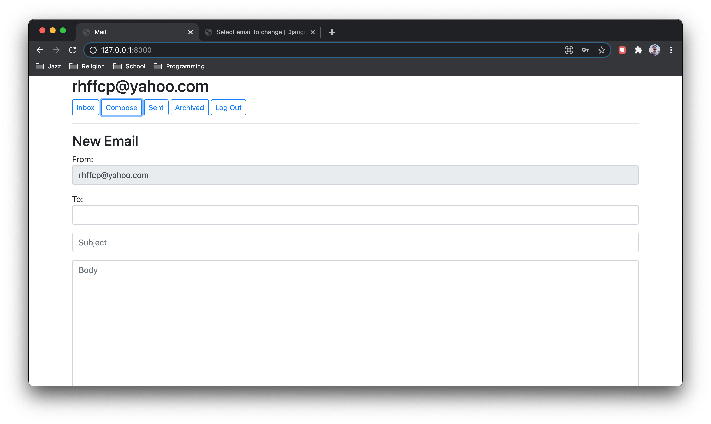
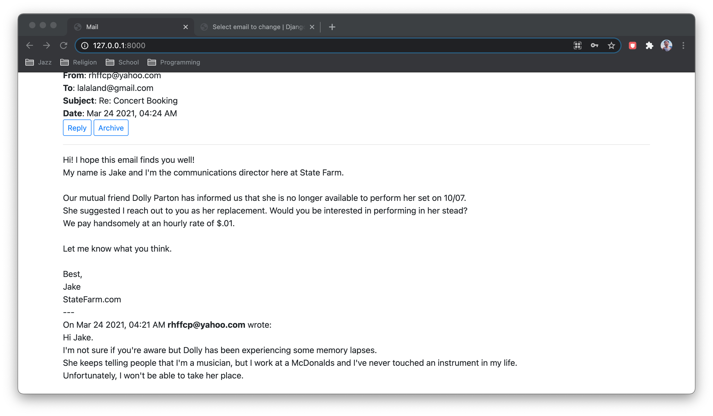

# Email Client





## Description
This project uses HTML, CSS, Django + Django models, and JavaScript to create an email client where users can send and recieve emails. It follows all the requirements of [CS50W's Mail](https://cs50.harvard.edu/web/2020/projects/3/mail/) project, plus additional customization.

- This app makes calls to a prewritten API (documented [here](https://cs50.harvard.edu/web/2020/projects/3/mail/)) to retrieve, send, and update emails.

- Users can sign in or register an account to compose, view, reply, archive, and unarchive emails within the app.

- If an email is read, its background is grayed out, otherwise, the background is white.

- A site administrator should be able to view, edit, and delete any email or user.

## Requirements
This project utilizes the [Django](https://www.djangoproject.com/download/) framework.

## Running
To run this application, change into the outer mail directory and run the following command from the terminal:

```
$ python manage.py runserver
```

Once the Django development server runs, visit the server's address to open the app.

### Admin
To use the admin interface, you must create a superuser account by changing into the outer mail directory and running the following command from the terminal:

```
$ python manage.py createsuperuser
```

